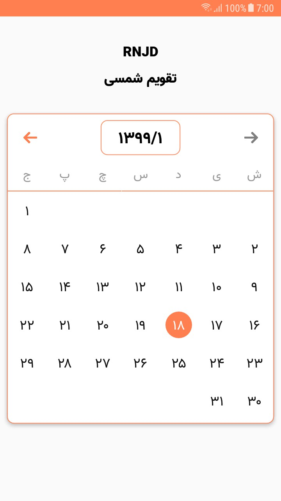
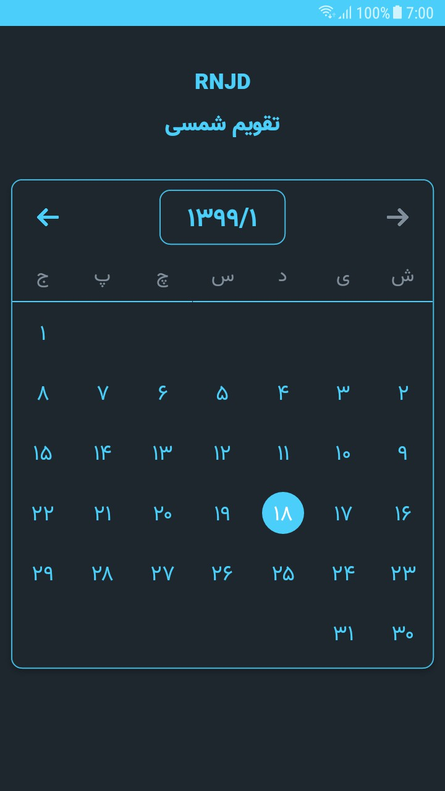

# react-native-jalali-datepicker

<div align="center">

[](https://github.com/MohamadKh75/react-native-jalali-datepicker/pulls) &nbsp; [](https://github.com/prettier/prettier) &nbsp; [](https://badge.fury.io/js/%40mohamadkh75%2Freact-native-jalali-datepicker) &nbsp; [](https://github.com/MohamadKh75/react-native-jalali-datepicker/blob/master/LICENSE)

</div>

---

## Preview

<div align="center">

&nbsp; &nbsp; &nbsp;

</div>

## Install

| Package Manager |                          Command                           |
| :-------------: | :--------------------------------------------------------: |
|    **yarn**     |   `yarn add @mohamadkh75/react-native-jalali-datepicker`   |
|     **npm**     | `npm i --save @mohamadkh75/react-native-jalali-datepicker` |

## Usage

```jsx
import DatePicker from '@mohamadkh75/react-native-jalali-datepicker';

<DatePicker
  style={{
    width: '95%',
    height: '80%',
    alignSelf: 'center',
    backgroundColor: '#1e272e',
    borderWidth: 1,
    borderColor: '#4bcffa',
    borderRadius: 10,
    elevation: 4
  }}
  selected='1399/1/18'
  dateSeparator='/'
  minDate='1398/1/18'
  maxDate='1400/1/18'
  headerContainerStyle={{ height: '15%' }}
  yearMonthBoxStyle={{
    width: '30%',
    height: '75%',
    justifyContent: 'center',
    alignItems: 'center',
    borderWidth: 1,
    borderRadius: 10
  }}
  yearMonthTextStyle={{ fontSize: 22, color: '#4bcffa' }}
  iconContainerStyle={{ width: `${100 / 7}%` }}
  backIconStyle={{
    width: 20,
    height: 20,
    resizeMode: 'center',
    tintColor: '#808e9b'
  }}
  nextIconStyle={{
    width: 20,
    height: 20,
    resizeMode: 'center',
    tintColor: '#4bcffa'
  }}
  eachYearStyle={{
    width: 110,
    height: 82,
    justifyContent: 'center',
    alignItems: 'center',
    backgroundColor: '#4bcffa',
    marginTop: '1.5%',
    marginBottom: 5,
    marginHorizontal: '1.5%',
    borderRadius: 10,
    elevation: 3
  }}
  eachYearTextStyle={{
    fontSize: 16,
    color: 'white'
  }}
  eachMonthStyle={{
    width: `${88 / 3}%`,
    height: `${88 / 4}%`,
    justifyContent: 'center',
    alignItems: 'center',
    backgroundColor: '#4bcffa',
    marginBottom: '3%',
    borderRadius: 10,
    elevation: 3
  }}
  eachMonthTextStyle={{ fontSize: 16, color: 'white' }}
  weekdaysContainerStyle={{ height: '10%' }}
  weekdayStyle={{
    flex: 1,
    justifyContent: 'center',
    alignItems: 'center'
  }}
  weekdayTextStyle={{
    fontSize: 16,
    color: '#808e9b',
    marginBottom: 5
  }}
  borderColor='#4bcffa'
  dayStyle={{
    width: `${100 / 7}%`,
    justifyContent: 'center',
    alignItems: 'center',
    aspectRatio: 1 / 1
  }}
  selectedDayStyle={{
    width: '70%',
    aspectRatio: 1 / 1,
    justifyContent: 'center',
    alignItems: 'center',
    borderRadius: 100
  }}
  selectedDayColor='#4bcffa'
  dayTextStyle={{ fontSize: 18 }}
  selectedDayTextColor='white'
  dayTextColor='#4bcffa'
  disabledTextColor='#4bcffa66'
  onDateChange={date => console.warn(date)}
/>;
```

## Properties

|          Prop          |                      Default                      |     Type     |
| :--------------------: | :-----------------------------------------------: | :----------: |
|         style          |          see [`Props.js`](src/props.js)           | `ViewStyle`  |
|        selected        |                       today                       |   `string`   |
|     dateSeparator      |                        `/`                        |   `string`   |
|        minDate         |                     last year                     |   `string`   |
|        maxDate         |                     next year                     |   `string`   |
|      onDateChange      |            date => console.warn(date)             |  `Function`  |
|  headerContainerStyle  |          see [`Props.js`](src/props.js)           | `ViewStyle`  |
|   yearMonthBoxStyle    |          see [`Props.js`](src/props.js)           | `ViewStyle`  |
|   yearMonthTextStyle   |         { fontSize: 22, color: 'black' }          | `TextStyle`  |
|   iconContainerStyle   |          see [`Props.js`](src/props.js)           | `ViewStyle`  |
|     backIconStyle      |          see [`Props.js`](src/props.js)           | `ImageStyle` |
|     nextIconStyle      |          see [`Props.js`](src/props.js)           | `ImageStyle` |
|     eachYearStyle      |          see [`Props.js`](src/props.js)           | `ViewStyle`  |
|   eachYearTextStyle    |         { fontSize: 16, color: 'white' }          | `TextStyle`  |
|     eachMonthStyle     |          see [`Props.js`](src/props.js)           | `ViewStyle`  |
|   eachMonthTextStyle   |         { fontSize: 16, color: 'white' }          | `TextStyle`  |
| weekdaysContainerStyle |          see [`Props.js`](src/props.js)           | `ViewStyle`  |
|      weekdayStyle      |          see [`Props.js`](src/props.js)           | `ViewStyle`  |
|    weekdayTextStyle    | { fontSize: 16, color: 'black', marginBottom: 5 } | `TextStyle`  |
|      borderColor       |                      `coral`                      |   `string`   |
|        dayStyle        |          see [`Props.js`](src/props.js)           | `ViewStyle`  |
|    selectedDayStyle    |          see [`Props.js`](src/props.js)           | `ViewStyle`  |
|    selectedDayColor    |                      `coral`                      |   `string`   |
|      dayTextStyle      |                 { fontSize: 18 }                  | `TextStyle`  |
|  selectedDayTextColor  |                     `#FFFFFF`                     |   `string`   |
|      dayTextColor      |                     `#111111`                     |   `string`   |
|   disabledTextColor    |                     `#999999`                     |   `string`   |

## Example

Take a look at [example](example):

```bash
git clone https://github.com/MohamadKh75/react-native-jalali-datepicker.git

cd example

yarn

react-native run-android

# OR

react-native run-ios
```

## Acknowledgements

I used [Vazir font](http://rastikerdar.github.io/vazir-font/) by [Saber Rastikerdar](https://github.com/rastikerdar) in example app!

## License

MIT
